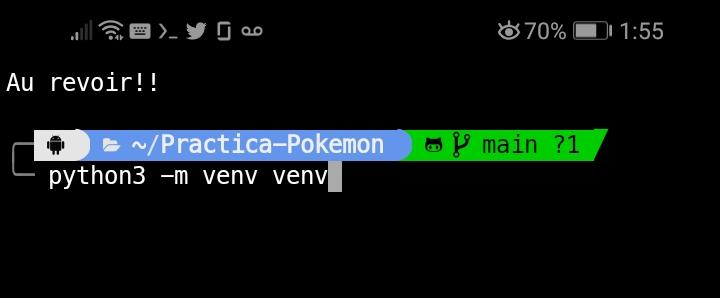
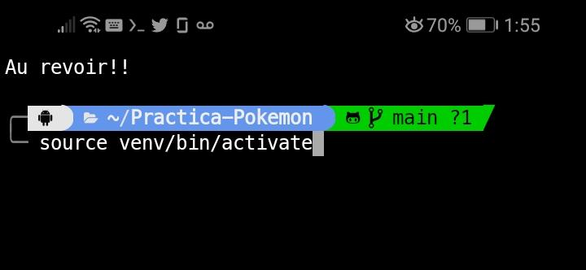
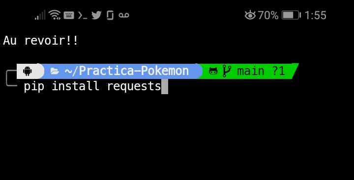
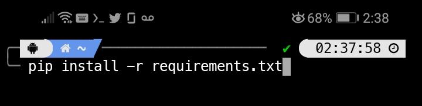
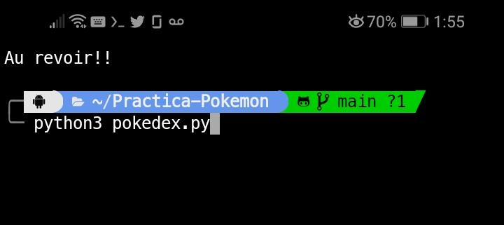

# POKÉDEX IN YOUR SHELL


---
## Steps for clone repository:

* First copy the URL:
https://github.com/Cervantes21/Practica-Pokemon.git

* Now in your shell: 
Digit in your shell 'git clone https://github.com/Cervantes21/Practica-Pokemon.git'

* Open the sharpe with commmands:

```
 $ ls
```
```
 $ cd Practica-Pokemon/
```
```
 $ ls
```
```
$ python3 pokedex.py
```

Now input Enter for start
and choose number for research in your pokedex.

**Use "Z" for exit.**


---

Instead, you can watch more details with this [Notebook](https://github.com/Cervantes21/Practica-Pokemon/blob/main/Practica_de_tabulacion_de_datos_pokemon.ipynb)

[](https://github.com/Cervantes21/Practica-Pokemon/blob/main/Practica_de_tabulacion_de_datos_pokemon.ipynb)

---

## For Termux Shell

### Step 1:
```
python3 -m venv venv
```


### Step 2:
```
source venv/bin/activate
```


### Step 3:
```
pip install requests
```


### **Or you can install packages with pip: -r requirements.txt**
```
pip install -r requirements.txt
```

 
### Step 4:
```
python3 pokedex.py
```


### If you get out of virtual enviroment
```
deactivate
```

